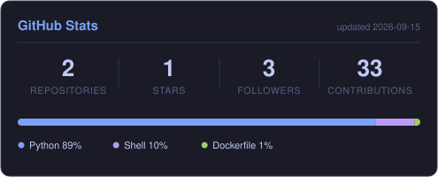

  

I self-host a few things at home: Home Assistant, a NAS, and some Docker containers.

I also build Home Assistant apps — [hassio-addons](https://github.com/lachesism233/hassio-addons).

Lately I've been messing with local LLMs and AI agents.

### Tech

  
  

### Stats

  

  
  
  

  

  

